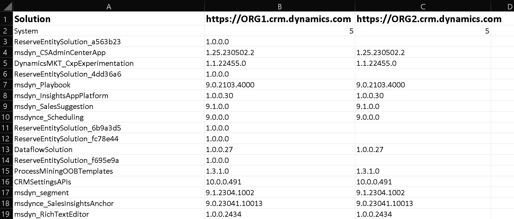

# D365SolutionVersionCompare

## Description

This is a Basic Proof Of Concept Tool to quickly compare Managed solution versions across multiple Dataverse Orgs using WebAPI queries in a .Net Standard console application.

## Input

The 'appsettings.json' file has a few settings that need to be set before running the tool.

### ConnectionString

- The example connection string formated for interactive login and only requires the 'username'. Each
- The connection string  is purposely formatted to have the 'Url' value ‘{0}’ as it dynamically built in the code for each of the given organization URLs provided in 'OrgUrls'.
- Dataverse Connection String Documentation can be found [here](https://learn.microsoft.com/en-us/power-apps/developer/data-platform/xrm-tooling/use-connection-strings-xrm-tooling-connect)

### OrgUrls

Provide an array of the Dataverse organization URLs that you want to compare.

### Output File
The file 'SolutionCompareOutput.csv' is generated in the same location as 'D365SolutionVersionCompare.exe'. Example output is below.



### Example 'appsettings.json' file

``` JSON
{  
  "ConnectionString": "AuthType=OAuth;Url={0};Username=XXXXX@XXXXX.onmicrosoft.com;RedirectUri=http://localhost;AppId=51f81489-12ee-4a9e-aaae-a2591f45987d;LoginPrompt=Auto",
  "OrgUrls": [
    {
      "URL": "https://ORG1.crm.dynamics.com"
    },
    {
      "URL": "https://ORG2.crm.dynamics.com"
    },
    {
      "URL": "https://ORG3.crm.dynamics.com"
    },
    {
      "URL": "https://ORG4.crm.dynamics.com"
    }
  ]
}
```
